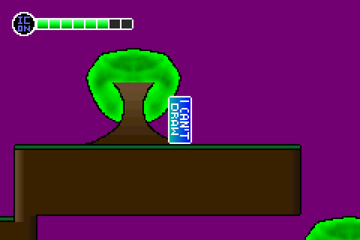
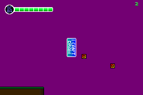
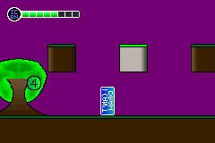
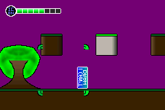
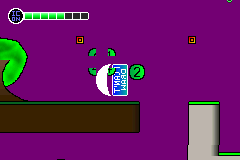
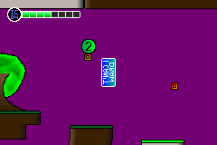
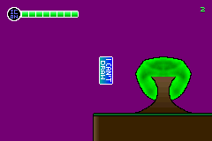

gba-modern
==========
The objective of this project is to aim to create a Game Boy Advance game using C++2a, while employing generators to the assets of the game.

Building
========
This project consists in a toolkit written in C++17 to generate assembly files for the resources (tilesets, maps and sprites as of writing), and it also includes the source files of the game, written in C++2a. The included *Makefile* makes sure all the files are properly built. It requires that devkitARM is installed and a "traditional" `g++` which supports C++17. **It also requires the `freetype` library!** Once all of those are done, you can properly `make` the project, and the ROM will be available with the name _gba-modern.gba_.

Editing the map files
---------------------
The Tiled map files included in the _tiled-maps_ folder can be edited; however, the tileset used to edit the file must be generating using
```
./gen-tilesets.sh
```
Otherwise, you risk failing to open the map files _and_ corrupting them.

We are running in a limited plataform, so unfortunately there are some expectations in the map generation. Currently, the tileset layout is specific, provided the combined tiles generated by all of them (47 for each autotile plus the tileset count) do not exceed 255. More documentation in the limitations of the maps is in the way.

Images
======









Contributing
============
All contribution is welcome. If you have interesting things to add, please submit a pull request!

Credits
=======
All files in this repository with exception of specific libraries and the fonts located in the _fonts_ foder are Copyright (c) 2019 João Baptista de Paula e Silva and are under the MIT license.

Niels Lohmann's "JSON for Modern C++" library can be found [here](https://github.com/nlohmann/json) and is also under the MIT license.

TinyXML2 belongs to Lee Thomason and can be found [here](https://github.com/leethomason/tinyxml2) under the zlib license.

The LodePNG files belong to Lode Vandevenne and can be found [here](https://lodev.org/lodepng/) also under the zlib license.

Finally, the base64 library belongs to René Nyffenegger and can be found [here](https://github.com/ReneNyffenegger/cpp-base64) under the zlib license.

The font _PixelFJVerdana12pt.ttf_ has its own license that can be seen [here](data/fonts/1001fonts-pix-pixelfjverdana12pt-eula.txt).
