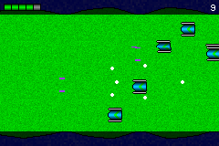

gba-modern
==========
The objective of this project is to aim to create a Game Boy Advance game using C++17, while employing generators to the assets of the game.

Building
========
**Warning:** currently the project does not work in a Windows environment! Use WSL to build it on Windows.

**Warning:** this repository uses submodules, be sure to initialize them properly by cloning this repo using the `--recursive` or then using the command `git submodule update --init` after cloning it!

This project consists in a toolkit written in C++17 to generate assembly files for the resources (tilesets, maps and sprites as of writing), and it also includes the source files of the game, written in C++17. The included *Makefile* makes sure all the files are properly built. It requires a `g++` which supports C++17 (possibly every Linux distribution has one). **It also requires the `freetype` library!** Once all of those are done, you can properly `make` the project, and the ROM will be available in the path _bin/game.gba_.

Screenshots and Videos
======================

[Working video](videos/video.mp4) | [Bitmask test video](videos/bitmask.mp4)

Contributing
============
All contribution is welcome. If you have interesting things to add, please submit a pull request!

Credits
=======
All files in this repository with exception of specific libraries and the fonts located in the _fonts_ foder are Copyright (c) 2019 João Baptista de Paula e Silva and are under the MIT license.

Niels Lohmann's "JSON for Modern C++" library can be found [here](https://github.com/nlohmann/json) and is also under the MIT license.

The LodePNG files belong to Lode Vandevenne and can be found [here](https://lodev.org/lodepng/) also under the zlib license.

The font _monogram.ttf_ belongs to Vinícius Menézio can be found [here](https://datagoblin.itch.io/monogram) under the CC0.

The font _Sweet16.ttf_ belongs to Martin Sedlák and can be found [here](https://github.com/kmar/Sweet16Font) under the Boost Software License.

The library GCE-Math used by generating LUTs belongs to Keith O'Hara and can be found [here](https://github.com/kthohr/gcem) under the Apache-2 License.

The font _Spleen_, used on the "Game Pak removed" screen, belongs to Frederic Cambus and can be found [here](https://github.com/fcambus/spleen) under the BSD-2 license.

Finally, the graphics for the "Game Pak removed" screen belong to Damian Yerrick (aka [pinobatch](https://github.com/pinobatch)) and are licensed under the CC0.
